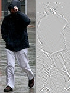

# Notes on a paper:

## Interesting points:
1. Modularizing vision pipelines in such a manner that relational query optimization can be applied.
2. Bringing together advances from two areas—machine vision and big data analytics systems, can lead to an efficient query answering system over many cameras.
3. Data from survillence cameras can reach TB of storage in a week. To decrease the size of data, for example, we can suppress frames early by only emitting ones that have motion.
4. IBM Smart Surveillance System had a pilot deployment in Chicago (2008), developed middleware that monitors scenes, stored video in a SQL database, and provided a web interface that reported both real-time alerts and allowed for long-term pattern mining.
5. Optasia has the same overall goals as IBM's S3, however, Optasia's key contributions (improved vision modules and casting vision queries into a distributed dataflow system with query optimization and scale-out) substantially improve upon S3.
6. Typical inputs to a surveillance system are low resolution videos.
7. HOG features: the histogram of oriented gradients is a feature descriptor used in computer vision and image processing for the purpose of object detection. The technique counts occurrences of gradient orientation in localized portions of an image. 
8. Standard feature extraction and classifiers suffice to extract vehicle type and color from surveillance videos but they do not suffice for more complex tasks such as detecting vehicle make and model.
9. Using key points to track objects, e.g., cars on a highway, the timestamps when they enter and exit the highway, the estimated (average) velocity.
10. Focus in this paper is on query answering systems over surveillance vides.

## Key contributions:
1. Optasia’s key value-add is a method to modularize vision pipelines so that the result is close enough to relational algebra and then adapting existing query optimization techniques for these pipelines. In other words, Optasia’s contribution lies in translating visual queries to a format that makes relational query optimization effective.
2. The system consists of several vision modules, including: feature extractors (e.g. HOG), models for classification and regression (SVM, random forests), keypoint extractors (SIFT), trackers (KLT), and segmentation (MOG - Mixture of Gaussians background subraction). The modules are in C++ with the OpenCV library. OpenCV (Open Source Computer Vision) is a library of programming functions mainly aimed at real-time computer vision. Originally developed by Intel. The library is cross-platform and free for use under the open-source BSD license. OpenCV supports the deep learning frameworks TensorFlow, Torch/PyTorch and Caffe (it is used to load and show images, split images into different channels, read pixel values, etc.). 

## Interesting ideas:
1. What is the correct representation of videos or frames? They suggest chunks consisting of many frames, where the chunks can contain overlapping frames. Consider counting the traffic volume (# of vehicles/min/lane) from a highway video. The query requires context across frames to avoid duplicate counts and hence frame-level parallelism leads to an incorrect answer. However, camera-level parallelism leads to skew (if one camera processes a busy road portion) and slow response times, because a single task has to process all the frames from a camera. By observing that the context required is bounded to the duration for which vehicles remain in the frame of reference, Optasia breaks the feed from each camera into overlapping chunks of frames. This concept of chunk-level parallelism is important to combat skew and speed-up response times. In summary: this is a chunk-level parallelism technique that allow queries to keep context for bounded time across frames. They chunk the video into overlapping groups of frames. If vehicles transit the frame-of-view in $$\delta$$ frames, then chunk-n may have frames $$\[ns−\delta,ns+s\]$$. That is, the reducer processing chunk-n uses the first $$\delta$$ frames only to warm-up its internal state (e.g., assess the background for background subtraction or detect keypoints of vehicles that overlap entrance boxes); it then processes the remaining $$s$$ frames. The number of the frames per chunk $$s$$ and the amount of overlap $$\delta$$ are configuration variables. Chunk size $$s$$ is calculated by comparing the benefits from parallelization (smaller $$s$$ implies more parallelism) with the overheads (a fraction $$\frac{\delta}{s}$$ of the overall work is wasted). The amount of available resources and the need for fast query completion may also impact choice of $$s$$. Observe that with chunking the available degree of parallelism is now limited only by the chunk size ($$s$$) and no longer limited by the number of cameras.

## Future work:
1. Improved video stores (compression, careful index generation).
2. For now, the system works in a (mini)batch mode. Applying Optasia to a distributed stream engine, especially one that scales beyond the total memory size of the cluster, is a key area of future work.

## Summary:
1. Optasia - execute vision queries on top of a distributed dataflow system.
2. The system provides a SQL-like declarative language and simplifies the job of end-users and vision engineers.
3. It adapts a cost based query optimizer (QO) to bridge the gap between end-user queries and low-level vision modules.
